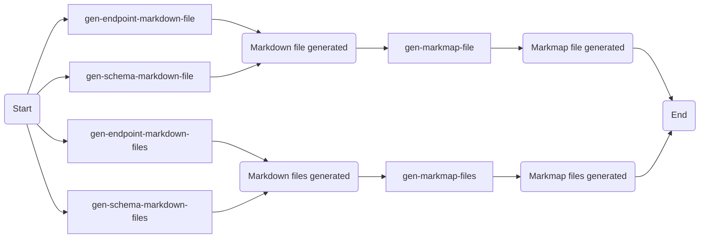
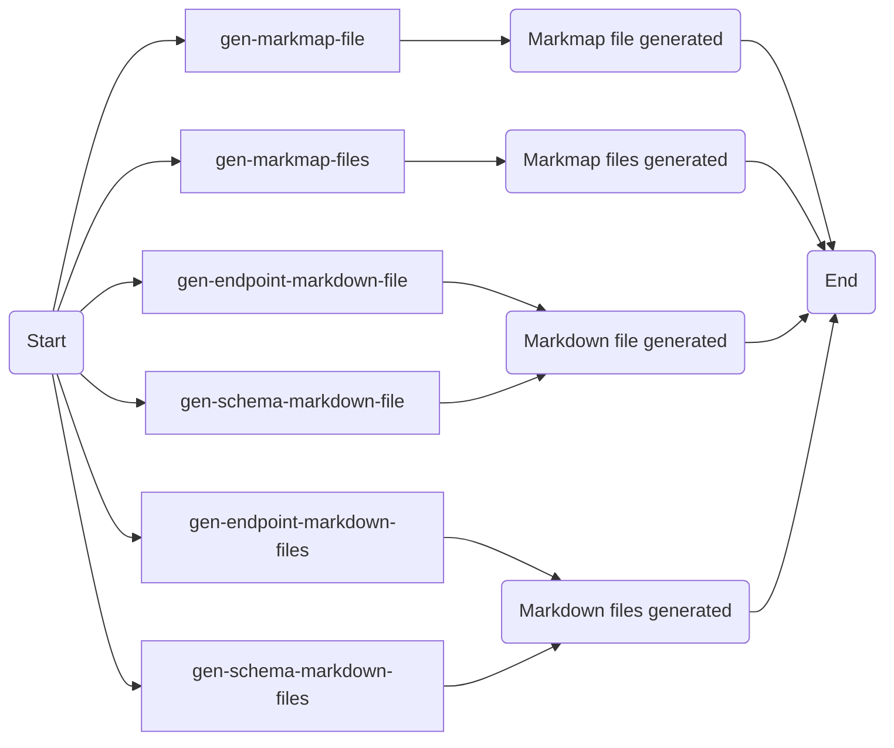
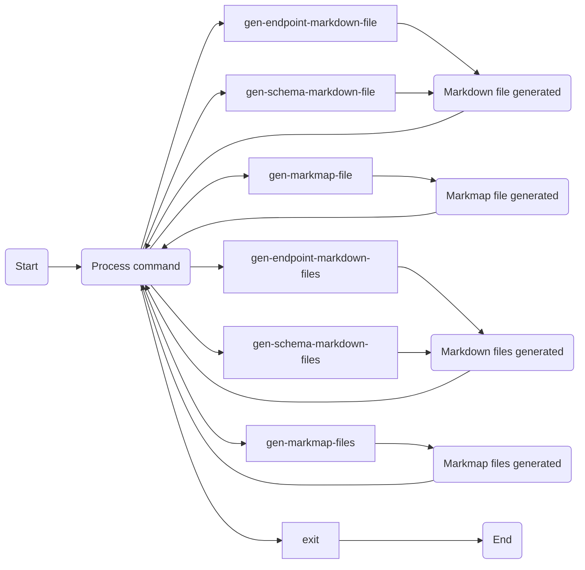

# OpenAPI Tools CLI

[](https://www.nuget.org/packages/Machy.OpenApi.Tools.Cli/)

The console application that generates markdown files and markmap files from Open API definition to visualize endpoints and schemas.

## Installation

To install the tool, run the command:

`dotnet tool install --global Machy.OpenApi.Tools.Cli`

## Prerequisities

* Required: Either `.NET6` or `.NET7` must be installed on your machine
* Optional: Install npm package [markmap-cli](https://www.npmjs.com/package/markmap-cli) `npm install -g markmap-cli`

## Generating markdown and markmap files

Run the tool `openapi-markmap-tool`.

There are two ways to run the tool:
- with arguments - executes the command and exit immediatelly
- without arguments - invokes commands you type until you send `exit` command

## Flow

The general flow to generate markmap file(s) for the endpoint(s) or the schema(s):



The flow differs when the `openapi-markmap-tool` tool is executed with or without the arguments

### With arguments

Only one command is executed.



### Without arguments

You can execute any command. The `exit` command exits the tool. If previous command is still running, the `exit` command cancels the running command before the tool is exited.



## Commands

There are two groups of commands. One group for generating Markdown file(s) and the second group for generating markmap file(s). The Open API definition can be read either from a file or from an URL.

### Generate markdown file for endpoint

```
gen-endpoint-markdown-file file --input-file C:\\Temp\\OpenApi\\transformed_v1.0_metadata.xml.yaml --endpoint /users --output-file C:\\Temp\\User.md
gen-endpoint-markdown-file abs-url --absolute-url https://raw.githubusercontent.com/OAI/OpenAPI-Specification/master/examples/v3.0/petstore.yaml --endpoint /pets --output-file C:\\Temp\\Pets.md
gen-endpoint-markdown-file rel-url --base-url https://raw.githubusercontent.com/OAI/OpenAPI-Specification/ --relative-url master/examples/v3.0/petstore.yaml --endpoint /pets --output-file C:\\Temp\\Pets.md
```

### Generate markdown files for endpoints

```
gen-endpoint-markdown-files file --input-file C:\\Temp\\OpenApi\\transformed_v1.0_metadata.xml.yaml --search-pattern users --output-folder C:\\Temp\\API\\v1
gen-endpoint-markdown-files abs-url --absolute-url https://raw.githubusercontent.com/OAI/OpenAPI-Specification/master/examples/v3.0/petstore.yaml --search-pattern "^(?=.*\bpets\b)(?=.*\bid\b).*$" --output-folder C:\\Temp\\API\\v1
gen-endpoint-markdown-files rel-url --base-url https://raw.githubusercontent.com/OAI/OpenAPI-Specification/ --relative-url master/examples/v3.0/petstore.yaml --search-pattern pet --output-folder C:\\Temp\\API\\v1
```

For each endpoint, the **endpoint.md** file is generated. For each part of the path a new folder is created. It ensures that each folder contains only one **endpoint.md** file.

#### Example

The Open API definition contains paths `/users`, `/users/{user-id}`, `/users/delta()`, and `/users/$count`. The `gen-endpoint-markdown-files` command will create these folders and files:

```
\users\$count\endpoint.md
\users\{user-id}\endpoint.md
\users\delta()\endpoint.md
\users\endpoint.md
```

### Generate markdown file for schema

```
gen-schema-markdown-file file --input-file C:\\Temp\\OpenApi\\transformed_v1.0_metadata.xml.yaml --schema microsoft.graph.user --output-file C:\\Temp\\OpenAPI\\_schema\\User.md
gen-schema-markdown-file abs-url --absolute-url https://github.com/microsoftgraph/msgraph-metadata/raw/master/transformed_v1.0_metadata.xml.yaml --schema microsoft.graph.user --output-file C:\\Temp\\OpenAPI\\_schema\\User.md
gen-schema-markdown-file rel-url --base-url https://github.com/microsoftgraph/msgraph-metadata/raw/ --relative-url master/transformed_v1.0_metadata.xml.yaml --schema microsoft.graph.user --output-file C:\\Temp\\OpenAPI\\_schema\\User.md
```

The name of the schema is case sensitive. Run the `list-schemas` command to list all names.

### Generate markdown files for schemas

```
gen-schema-markdown-files file --input-file C:\\Temp\\OpenApi\\transformed_v1.0_metadata.xml.yaml --search-pattern user --output-folder C:\\Temp\\OpenAPI\\_schema
gen-schema-markdown-files abs-url --absolute-url https://github.com/microsoftgraph/msgraph-metadata/raw/master/transformed_v1.0_metadata.xml.yaml --search-pattern "^(?=.*\bmicro\b)(?=.*\badmin\b).*$" --output-folder C:\\Temp\\OpenAPI\\_schema
gen-schema-markdown-files rel-url --base-url https://github.com/microsoftgraph/msgraph-metadata/raw/ --relative-url master/transformed_v1.0_metadata.xml.yaml --search-pattern security --output-folder C:\\Temp\\OpenAPI\\_schema
```

### Generate markmap file

Generate markmap file for one Markdown file.

```
gen-markmap-file --input-file C:\\Temp\\User.md --output-file C:\\Temp\\User.html
```

### Generate markmap files

Generate markmap files for all Markdown files from a praticular folder, and all subfolders.

```
gen-markmap-files --input-folder C:\\Temp\\OpenAPI\\v1.0 --output-folder C:\\Temp\\OpenAPI\\v1.0
```

The name of the markmap `.html` file is identical to the name of Markdown `.md` file. The `.html` file is generated in the same folder as the `.md` file.

### List endpoints

```
list-endpoints file --input-file C:\\Temp\\OpenApi\\transformed_v1.0_metadata.xml.yaml
list-endpoints abs-url --absolute-url https://github.com/microsoftgraph/msgraph-metadata/raw/master/transformed_v1.0_metadata.xml.yaml
list-endpoints rel-url --base-url https://github.com/microsoftgraph/msgraph-metadata/raw/ --relative-url master/transformed_v1.0_metadata.xml.yaml
```

### List schemas

```
list-schemas file --input-file C:\\Temp\\OpenApi\\transformed_v1.0_metadata.xml.yaml
list-schemas abs-url --absolute-url https://github.com/microsoftgraph/msgraph-metadata/raw/master/transformed_v1.0_metadata.xml.yaml
list-schemas rel-url --base-url https://github.com/microsoftgraph/msgraph-metadata/raw/ --relative-url master/transformed_v1.0_metadata.xml.yaml
```

### Details

Run `help` for each command to see what are the additional options.

```
gen-schema-markdown-file file --help
gen-schema-markdown-file abs-url --help
gen-schema-markdown-file rel-url --help

gen-schema-markdown-files file --help
gen-schema-markdown-files abs-url --help
gen-schema-markdown-files rel-url --help

gen-markmap-file --help

gen-markmap-files --help

list-endpoints file --help
list-endpoints abs-url --help
list-endpoints rel-url --help

list-schemas file --help
list-schemas abs-url --help
list-schemas rel-url --help
```

### `gen-endpoint-markdown-file file`

```
Usage:
  OpenApi.Tools.Cli gen-endpoint-markdown-file file [options]

Options:
  -i, --input-file <input-file> (REQUIRED)           The path to yaml/json file with Open API definition.
  -e, --endpoint <endpoint> (REQUIRED)               The source endpoint like /users/{user_id}/messages/{message_id}.
  -o, --output-file <output-file> (REQUIRED)         The output file path.
  -f, --color-freeze-level <color-freeze-level>      Freeze color at the specified level of branches. 0 for no freezing
                                                     at all. [default: 6]
  -n, --initial-expand-level <initial-expand-level>  The maximum level of nodes to expand on initial render. -1 for
                                                     expanding all levels. [default: 5]
  -c, --color <color>                                A list of colors to use as the branch and circle colors for each
                                                     node. If none is provided, d3.schemeCategory10 will be used. []
  -d, --duration <duration>                          The animation duration when folding/unfolding a node. [default:
                                                     500]
  -m, --max-width <max-width>                        The max width of each node content. 0 for no limit. [default: 0]
  -z, --zoom                                         Whether to allow zooming the markmap. [default: True]
  -p, --pan                                          Whether to allow panning the markmap. [default: True]
  -x, --max-schema-depth <max-schema-depth>          Affects how deep the writer goes in case of OpenApiSchema and its
                                                     properties. [default: 3]
  -s, --max-single-items <max-single-items>          The size of OpenApiSchema Enum/Propeties collection when items are
                                                     printed one per line. [default: 10]
  -g, --group-items-size <group-items-size>          Number of items from OpenApiSchema Enum/Properties that printed on
                                                     one line if the size of OpenApiSchema Enum/Properties exceeds
                                                     MaxSingleItems. [default: 6]
  -h, --show-name-in-root                        If true then name of the endpoint or the schema is displayed in the root, otherwise as the
                                                     first subitem. [default: True]
  -?, -h, --help                                     Show help and usage information
```

### `gen-endpoint-markdown-file abs-url`

```
Usage:
  OpenApi.Tools.Cli gen-endpoint-markdown-file abs-url [options]

Options:
  -a, --absolute-url <absolute-url> (REQUIRED)       Absolute URL.
  -e, --endpoint <endpoint> (REQUIRED)               The source endpoint like /users/{user_id}/messages/{message_id}.
  -o, --output-file <output-file> (REQUIRED)         The output file path.
  -f, --color-freeze-level <color-freeze-level>      Freeze color at the specified level of branches. 0 for no freezing
                                                     at all. [default: 6]
  -n, --initial-expand-level <initial-expand-level>  The maximum level of nodes to expand on initial render. -1 for
                                                     expanding all levels. [default: 5]
  -c, --color <color>                                A list of colors to use as the branch and circle colors for each
                                                     node. If none is provided, d3.schemeCategory10 will be used. []
  -d, --duration <duration>                          The animation duration when folding/unfolding a node. [default:
                                                     500]
  -m, --max-width <max-width>                        The max width of each node content. 0 for no limit. [default: 0]
  -z, --zoom                                         Whether to allow zooming the markmap. [default: True]
  -p, --pan                                          Whether to allow panning the markmap. [default: True]
  -x, --max-schema-depth <max-schema-depth>          Affects how deep the writer goes in case of OpenApiSchema and its
                                                     properties. [default: 3]
  -s, --max-single-items <max-single-items>          The size of OpenApiSchema Enum/Propeties collection when items are
                                                     printed one per line. [default: 10]
  -g, --group-items-size <group-items-size>          Number of items from OpenApiSchema Enum/Properties that printed on
                                                     one line if the size of OpenApiSchema Enum/Properties exceeds
                                                     MaxSingleItems. [default: 6]
  -h, --show-name-in-root                        If true then name of the endpoint or the schema is displayed in the root, otherwise as the
                                                     first subitem. [default: True]
  -?, -h, --help                                     Show help and usage information
```

### `gen-endpoint-markdown-file rel-url`

```
Usage:
  OpenApi.Tools.Cli gen-endpoint-markdown-file rel-url [options]

Options:
  -b, --base-url <base-url> (REQUIRED)               Base URL.
  -r, --relative-url <relative-url> (REQUIRED)       Relative URL.
  -e, --endpoint <endpoint> (REQUIRED)               The source endpoint like /users/{user_id}/messages/{message_id}.
  -o, --output-file <output-file> (REQUIRED)         The output file path.
  -f, --color-freeze-level <color-freeze-level>      Freeze color at the specified level of branches. 0 for no freezing
                                                     at all. [default: 6]
  -n, --initial-expand-level <initial-expand-level>  The maximum level of nodes to expand on initial render. -1 for
                                                     expanding all levels. [default: 5]
  -c, --color <color>                                A list of colors to use as the branch and circle colors for each
                                                     node. If none is provided, d3.schemeCategory10 will be used. []
  -d, --duration <duration>                          The animation duration when folding/unfolding a node. [default:
                                                     500]
  -m, --max-width <max-width>                        The max width of each node content. 0 for no limit. [default: 0]
  -z, --zoom                                         Whether to allow zooming the markmap. [default: True]
  -p, --pan                                          Whether to allow panning the markmap. [default: True]
  -x, --max-schema-depth <max-schema-depth>          Affects how deep the writer goes in case of OpenApiSchema and its
                                                     properties. [default: 3]
  -s, --max-single-items <max-single-items>          The size of OpenApiSchema Enum/Propeties collection when items are
                                                     printed one per line. [default: 10]
  -g, --group-items-size <group-items-size>          Number of items from OpenApiSchema Enum/Properties that printed on
                                                     one line if the size of OpenApiSchema Enum/Properties exceeds
                                                     MaxSingleItems. [default: 6]
  -h, --show-name-in-root                        If true then name of the endpoint or the schema is displayed in the root, otherwise as the
                                                     first subitem. [default: True]
  -?, -h, --help                                     Show help and usage information
```

### `gen-endpoint-markdown-files file`

```
Usage:
  OpenApi.Tools.Cli gen-endpoint-markdown-files file [options]

Options:
  -i, --input-file <input-file> (REQUIRED)           The path to yaml/json file with Open API definition.
  -s, --search-pattern <search-pattern> (REQUIRED)   The part of the path, or regular expression
  -o, --output-folder <output-folder> (REQUIRED)     The output folder where .md files will be generated.
  -f, --color-freeze-level <color-freeze-level>      Freeze color at the specified level of branches. 0 for no freezing
                                                     at all. [default: 6]
  -n, --initial-expand-level <initial-expand-level>  The maximum level of nodes to expand on initial render. -1 for
                                                     expanding all levels. [default: 5]
  -c, --color <color>                                A list of colors to use as the branch and circle colors for each
                                                     node. If none is provided, d3.schemeCategory10 will be used. []
  -d, --duration <duration>                          The animation duration when folding/unfolding a node. [default:
                                                     500]
  -m, --max-width <max-width>                        The max width of each node content. 0 for no limit. [default: 0]
  -z, --zoom                                         Whether to allow zooming the markmap. [default: True]
  -p, --pan                                          Whether to allow panning the markmap. [default: True]
  -x, --max-schema-depth <max-schema-depth>          Affects how deep the writer goes in case of OpenApiSchema and its
                                                     properties. [default: 3]
  -s, --max-single-items <max-single-items>          The size of OpenApiSchema Enum/Propeties collection when items are
                                                     printed one per line. [default: 10]
  -g, --group-items-size <group-items-size>          Number of items from OpenApiSchema Enum/Properties that printed on
                                                     one line if the size of OpenApiSchema Enum/Properties exceeds
                                                     MaxSingleItems. [default: 6]
  -h, --show-name-in-root                        If true then name of the endpoint or the schema is displayed in the root, otherwise as the
                                                     first subitem. [default: True]
  -?, -h, --help                                     Show help and usage information
```

### `gen-endpoint-markdown-files abs-url`

```
Usage:
  OpenApi.Tools.Cli gen-endpoint-markdown-files abs-url [options]

Options:
  -a, --absolute-url <absolute-url>                  Absolute URL.
  -s, --search-pattern <search-pattern> (REQUIRED)   The part of the path, or regular expression
  -o, --output-folder <output-folder> (REQUIRED)     The output folder where .md files will be generated.
  -f, --color-freeze-level <color-freeze-level>      Freeze color at the specified level of branches. 0 for no freezing
                                                     at all. [default: 6]
  -n, --initial-expand-level <initial-expand-level>  The maximum level of nodes to expand on initial render. -1 for
                                                     expanding all levels. [default: 5]
  -c, --color <color>                                A list of colors to use as the branch and circle colors for each
                                                     node. If none is provided, d3.schemeCategory10 will be used. []
  -d, --duration <duration>                          The animation duration when folding/unfolding a node. [default:
                                                     500]
  -m, --max-width <max-width>                        The max width of each node content. 0 for no limit. [default: 0]
  -z, --zoom                                         Whether to allow zooming the markmap. [default: True]
  -p, --pan                                          Whether to allow panning the markmap. [default: True]
  -x, --max-schema-depth <max-schema-depth>          Affects how deep the writer goes in case of OpenApiSchema and its
                                                     properties. [default: 3]
  -s, --max-single-items <max-single-items>          The size of OpenApiSchema Enum/Propeties collection when items are
                                                     printed one per line. [default: 10]
  -g, --group-items-size <group-items-size>          Number of items from OpenApiSchema Enum/Properties that printed on
                                                     one line if the size of OpenApiSchema Enum/Properties exceeds
                                                     MaxSingleItems. [default: 6]
  -h, --show-name-in-root                        If true then name of the endpoint or the schema is displayed in the root, otherwise as the
                                                     first subitem. [default: True]
  -?, -h, --help                                     Show help and usage information
```

### `gen-endpoint-markdown-files rel-url`

```
Usage:
  OpenApi.Tools.Cli gen-endpoint-markdown-files rel-url [options]

Options:
  -b, --base-url <base-url>                          Base URL.
  -r, --relative-url <relative-url> (REQUIRED)       Relative URL.
  -s, --search-pattern <search-pattern> (REQUIRED)   The part of the path, or regular expression
  -o, --output-folder <output-folder> (REQUIRED)     The output folder where .md files will be generated.
  -f, --color-freeze-level <color-freeze-level>      Freeze color at the specified level of branches. 0 for no freezing
                                                     at all. [default: 6]
  -n, --initial-expand-level <initial-expand-level>  The maximum level of nodes to expand on initial render. -1 for
                                                     expanding all levels. [default: 5]
  -c, --color <color>                                A list of colors to use as the branch and circle colors for each
                                                     node. If none is provided, d3.schemeCategory10 will be used. []
  -d, --duration <duration>                          The animation duration when folding/unfolding a node. [default:
                                                     500]
  -m, --max-width <max-width>                        The max width of each node content. 0 for no limit. [default: 0]
  -z, --zoom                                         Whether to allow zooming the markmap. [default: True]
  -p, --pan                                          Whether to allow panning the markmap. [default: True]
  -x, --max-schema-depth <max-schema-depth>          Affects how deep the writer goes in case of OpenApiSchema and its
                                                     properties. [default: 3]
  -s, --max-single-items <max-single-items>          The size of OpenApiSchema Enum/Propeties collection when items are
                                                     printed one per line. [default: 10]
  -g, --group-items-size <group-items-size>          Number of items from OpenApiSchema Enum/Properties that printed on
                                                     one line if the size of OpenApiSchema Enum/Properties exceeds
                                                     MaxSingleItems. [default: 6]
  -h, --show-name-in-root                        If true then name of the endpoint or the schema is displayed in the root, otherwise as the
                                                     first subitem. [default: True]
  -?, -h, --help                                     Show help and usage information
```

### `gen-schema-markdown-file file`

```
Usage:
  OpenApi.Tools.Cli gen-schema-markdown-file file [options]

Options:
  -i, --input-file <input-file> (REQUIRED)           The path to yaml/json file with Open API definition.
  -e, --schema <schema> (REQUIRED)                   The schema like microsoft.graph.user.
  -o, --output-file <output-file> (REQUIRED)         The output file path.
  -f, --color-freeze-level <color-freeze-level>      Freeze color at the specified level of branches. 0 for no freezing at all. [default: 6]
  -n, --initial-expand-level <initial-expand-level>  The maximum level of nodes to expand on initial render. -1 for expanding all levels. [default: 5]
  -c, --color <color>                                A list of colors to use as the branch and circle colors for each node. If none is provided, d3.schemeCategory10 will be used. []
  -d, --duration <duration>                          The animation duration when folding/unfolding a node. [default: 500]
  -m, --max-width <max-width>                        The max width of each node content. 0 for no limit. [default: 0]
  -z, --zoom                                         Whether to allow zooming the markmap. [default: True]
  -p, --pan                                          Whether to allow panning the markmap. [default: True]
  -x, --max-schema-depth <max-schema-depth>          Affects how deep the writer goes in case of OpenApiSchema and its properties. [default: 2]
  -s, --max-single-items <max-single-items>          The size of OpenApiSchema Enum/Propeties collection when items are printed one per line. [default: 0]
  -g, --group-items-size <group-items-size>          Number of items from OpenApiSchema Enum/Properties that printed on one line if the size of OpenApiSchema Enum/Properties exceeds
                                                     MaxSingleItems. [default: 0]
  -h, --show-name-in-root                        If true then name of the endpoint or the schema is displayed in the root, otherwise as the first subitem. [default: True]
  -?, -h, --help                                     Show help and usage information
```

### `gen-schema-markdown-file abs-url`

```
Usage:
  OpenApi.Tools.Cli gen-schema-markdown-file abs-url [options]

Options:
  -a, --absolute-url <absolute-url> (REQUIRED)       Absolute URL.
  -e, --schema <schema> (REQUIRED)                   The schema like microsoft.graph.user.
  -o, --output-file <output-file> (REQUIRED)         The output file path.
  -f, --color-freeze-level <color-freeze-level>      Freeze color at the specified level of branches. 0 for no freezing
                                                     at all. [default: 6]
  -n, --initial-expand-level <initial-expand-level>  The maximum level of nodes to expand on initial render. -1 for
                                                     expanding all levels. [default: 5]
  -c, --color <color>                                A list of colors to use as the branch and circle colors for each
                                                     node. If none is provided, d3.schemeCategory10 will be used. []
  -d, --duration <duration>                          The animation duration when folding/unfolding a node. [default:
                                                     500]
  -m, --max-width <max-width>                        The max width of each node content. 0 for no limit. [default: 0]
  -z, --zoom                                         Whether to allow zooming the markmap. [default: True]
  -p, --pan                                          Whether to allow panning the markmap. [default: True]
  -x, --max-schema-depth <max-schema-depth>          Affects how deep the writer goes in case of OpenApiSchema and its
                                                     properties. [default: 2]
  -s, --max-single-items <max-single-items>          The size of OpenApiSchema Enum/Propeties collection when items are
                                                     printed one per line. [default: 0]
  -g, --group-items-size <group-items-size>          Number of items from OpenApiSchema Enum/Properties that printed on
                                                     one line if the size of OpenApiSchema Enum/Properties exceeds
                                                     MaxSingleItems. [default: 0]
  -h, --show-name-in-root                        If true then name of the endpoint or the schema is displayed in the root, otherwise as the
                                                     first subitem. [default: True]
  -?, -h, --help                                     Show help and usage information
```

### `gen-schema-markdown-file rel-url`

```
Usage:
  OpenApi.Tools.Cli gen-schema-markdown-file rel-url [options]

Options:
  -b, --base-url <base-url> (REQUIRED)               Base URL.
  -r, --relative-url <relative-url> (REQUIRED)       Relative URL.
  -e, --schema <schema> (REQUIRED)                   The schema like microsoft.graph.user.
  -o, --output-file <output-file> (REQUIRED)         The output file path.
  -f, --color-freeze-level <color-freeze-level>      Freeze color at the specified level of branches. 0 for no freezing
                                                     at all. [default: 6]
  -n, --initial-expand-level <initial-expand-level>  The maximum level of nodes to expand on initial render. -1 for
                                                     expanding all levels. [default: 5]
  -c, --color <color>                                A list of colors to use as the branch and circle colors for each
                                                     node. If none is provided, d3.schemeCategory10 will be used. []
  -d, --duration <duration>                          The animation duration when folding/unfolding a node. [default:
                                                     500]
  -m, --max-width <max-width>                        The max width of each node content. 0 for no limit. [default: 0]
  -z, --zoom                                         Whether to allow zooming the markmap. [default: True]
  -p, --pan                                          Whether to allow panning the markmap. [default: True]
  -x, --max-schema-depth <max-schema-depth>          Affects how deep the writer goes in case of OpenApiSchema and its
                                                     properties. [default: 2]
  -s, --max-single-items <max-single-items>          The size of OpenApiSchema Enum/Propeties collection when items are
                                                     printed one per line. [default: 0]
  -g, --group-items-size <group-items-size>          Number of items from OpenApiSchema Enum/Properties that printed on
                                                     one line if the size of OpenApiSchema Enum/Properties exceeds
                                                     MaxSingleItems. [default: 0]
  -h, --show-name-in-root                        If true then name of the endpoint or the schema is displayed in the root, otherwise as the
                                                     first subitem. [default: True]
  -?, -h, --help                                     Show help and usage information
```

### `gen-schema-markdown-files file`

```
Usage:
  OpenApi.Tools.Cli gen-schema-markdown-files file [options]

Options:
  -i, --input-file <input-file> (REQUIRED)           The path to yaml/json file with Open API definition.
  -s, --search-pattern <search-pattern> (REQUIRED)   The part of the schema, or regular expression
  -o, --output-folder <output-folder> (REQUIRED)     The output folder where .md files will be generated.
  -f, --color-freeze-level <color-freeze-level>      Freeze color at the specified level of branches. 0 for no freezing
                                                     at all. [default: 6]
  -n, --initial-expand-level <initial-expand-level>  The maximum level of nodes to expand on initial render. -1 for
                                                     expanding all levels. [default: 5]
  -c, --color <color>                                A list of colors to use as the branch and circle colors for each
                                                     node. If none is provided, d3.schemeCategory10 will be used. []
  -d, --duration <duration>                          The animation duration when folding/unfolding a node. [default:
                                                     500]
  -m, --max-width <max-width>                        The max width of each node content. 0 for no limit. [default: 0]
  -z, --zoom                                         Whether to allow zooming the markmap. [default: True]
  -p, --pan                                          Whether to allow panning the markmap. [default: True]
  -x, --max-schema-depth <max-schema-depth>          Affects how deep the writer goes in case of OpenApiSchema and its
                                                     properties. [default: 2]
  -s, --max-single-items <max-single-items>          The size of OpenApiSchema Enum/Propeties collection when items are
                                                     printed one per line. [default: 0]
  -g, --group-items-size <group-items-size>          Number of items from OpenApiSchema Enum/Properties that printed on
                                                     one line if the size of OpenApiSchema Enum/Properties exceeds
                                                     MaxSingleItems. [default: 0]
  -h, --show-name-in-root                        If true then name of the endpoint or the schema is displayed in the root, otherwise as the
                                                     first subitem. [default: True]
  -?, -h, --help                                     Show help and usage information
```

### `gen-schema-markdown-files abs-url`

```
Usage:
  OpenApi.Tools.Cli gen-schema-markdown-files abs-url [options]

Options:
  -a, --absolute-url <absolute-url>                  Absolute URL.
  -s, --search-pattern <search-pattern> (REQUIRED)   The part of the schema, or regular expression
  -o, --output-folder <output-folder> (REQUIRED)     The output folder where .md files will be generated.
  -f, --color-freeze-level <color-freeze-level>      Freeze color at the specified level of branches. 0 for no freezing
                                                     at all. [default: 6]
  -n, --initial-expand-level <initial-expand-level>  The maximum level of nodes to expand on initial render. -1 for
                                                     expanding all levels. [default: 5]
  -c, --color <color>                                A list of colors to use as the branch and circle colors for each
                                                     node. If none is provided, d3.schemeCategory10 will be used. []
  -d, --duration <duration>                          The animation duration when folding/unfolding a node. [default:
                                                     500]
  -m, --max-width <max-width>                        The max width of each node content. 0 for no limit. [default: 0]
  -z, --zoom                                         Whether to allow zooming the markmap. [default: True]
  -p, --pan                                          Whether to allow panning the markmap. [default: True]
  -x, --max-schema-depth <max-schema-depth>          Affects how deep the writer goes in case of OpenApiSchema and its
                                                     properties. [default: 2]
  -s, --max-single-items <max-single-items>          The size of OpenApiSchema Enum/Propeties collection when items are
                                                     printed one per line. [default: 0]
  -g, --group-items-size <group-items-size>          Number of items from OpenApiSchema Enum/Properties that printed on
                                                     one line if the size of OpenApiSchema Enum/Properties exceeds
                                                     MaxSingleItems. [default: 0]
  -h, --show-name-in-root                        If true then name of the endpoint or the schema is displayed in the root, otherwise as the
                                                     first subitem. [default: True]
  -?, -h, --help                                     Show help and usage information
```

### `gen-schema-markdown-files rel-url`

```
Usage:
  OpenApi.Tools.Cli gen-schema-markdown-files rel-url [options]

Options:
  -b, --base-url <base-url>                          Base URL.
  -r, --relative-url <relative-url> (REQUIRED)       Relative URL.
  -s, --search-pattern <search-pattern> (REQUIRED)   The part of the schema, or regular expression
  -o, --output-folder <output-folder> (REQUIRED)     The output folder where .md files will be generated.
  -f, --color-freeze-level <color-freeze-level>      Freeze color at the specified level of branches. 0 for no freezing
                                                     at all. [default: 6]
  -n, --initial-expand-level <initial-expand-level>  The maximum level of nodes to expand on initial render. -1 for
                                                     expanding all levels. [default: 5]
  -c, --color <color>                                A list of colors to use as the branch and circle colors for each
                                                     node. If none is provided, d3.schemeCategory10 will be used. []
  -d, --duration <duration>                          The animation duration when folding/unfolding a node. [default:
                                                     500]
  -m, --max-width <max-width>                        The max width of each node content. 0 for no limit. [default: 0]
  -z, --zoom                                         Whether to allow zooming the markmap. [default: True]
  -p, --pan                                          Whether to allow panning the markmap. [default: True]
  -x, --max-schema-depth <max-schema-depth>          Affects how deep the writer goes in case of OpenApiSchema and its
                                                     properties. [default: 2]
  -s, --max-single-items <max-single-items>          The size of OpenApiSchema Enum/Propeties collection when items are
                                                     printed one per line. [default: 0]
  -g, --group-items-size <group-items-size>          Number of items from OpenApiSchema Enum/Properties that printed on
                                                     one line if the size of OpenApiSchema Enum/Properties exceeds
                                                     MaxSingleItems. [default: 0]
  -h, --show-name-in-root                        If true then name of the endpoint or the schema is displayed in the root, otherwise as the
                                                     first subitem. [default: True]
  -?, -h, --help                                     Show help and usage information
```

### `gen-markmap-file`

```
Usage:
  OpenApi.Tools.Cli gen-markmap-file [options]

Options:
  -i, --input-file <input-file> (REQUIRED)    Path to the input .md file.
  -o, --output-file <output-file> (REQUIRED)  Path to the output .html file.
  -?, -h, --help                              Show help and usage information
```

### `gen-markmap-files`

```
Usage:
  OpenApi.Tools.Cli gen-markmap-files [options]

Options:
  -i, --input-folder <input-folder> (REQUIRED)    Input folder with .md files.
  -o, --output-folder <output-folder> (REQUIRED)  Output folder where .html files will be generated.
  -?, -h, --help                                  Show help and usage information
```

### list-endpoints file

```
Usage:
  OpenApi.Tools.Cli list-endpoints file [options]

Options:
  -i, --input-file <input-file> (REQUIRED)  The path to yaml/json file with Open API definition.
  -?, -h, --help                            Show help and usage information
```

### list-endpoints abs-url

```
Usage:
  OpenApi.Tools.Cli list-endpoints abs-url [options]

Options:
  -a, --absolute-url <absolute-url> (REQUIRED)  Absolute URL.
  -?, -h, --help                                Show help and usage information
```

### list-endpoints rel-url

```
Usage:
  OpenApi.Tools.Cli list-endpoints rel-url [options]

Options:
  -b, --base-url <base-url> (REQUIRED)          Base URL.
  -r, --relative-url <relative-url> (REQUIRED)  Relative URL.
  -?, -h, --help                                Show help and usage information
```

### list-schemas file

```
Usage:
  OpenApi.Tools.Cli list-schemas file [options]

Options:
  -i, --input-file <input-file> (REQUIRED)  The path to yaml/json file with Open API definition.
  -?, -h, --help                            Show help and usage information
```

### list-schemas abs-url

```
Usage:
  OpenApi.Tools.Cli list-schemas abs-url [options]

Options:
  -a, --absolute-url <absolute-url> (REQUIRED)  Absolute URL.
  -?, -h, --help                                Show help and usage information
```

### list-schemas rel-url

```
Usage:
  OpenApi.Tools.Cli list-schemas rel-url [options]

Options:
  -b, --base-url <base-url> (REQUIRED)          Base URL.
  -r, --relative-url <relative-url> (REQUIRED)  Relative URL.
  -?, -h, --help                                Show help and usage information
```

## Known issues

1. This tool is using the [OpenAPI.NET](https://github.com/microsoft/OpenAPI.NET) SDK which doesn't release opened Open API document from the memory. Reported [issue](https://github.com/microsoft/OpenAPI.NET/issues/1330).

   When more Open API documents will be opened, the memory will be increasing.
2. It takes around 4 seconds to generate a markmap file by markmap-cli command. When generating markmap files for large Open API document, it can take around one hour to finish. 

## Recommendations

Additionally for Windows OS, to handle long path for generated Markdown or markmap files

> set the value of the parameter HKLM\SYSTEM\CurrentControlSet\Control\FileSystem LongPathsEnabled to 1