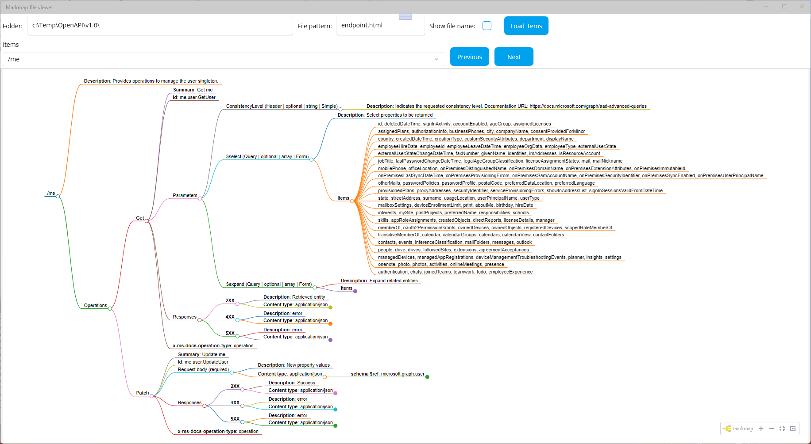
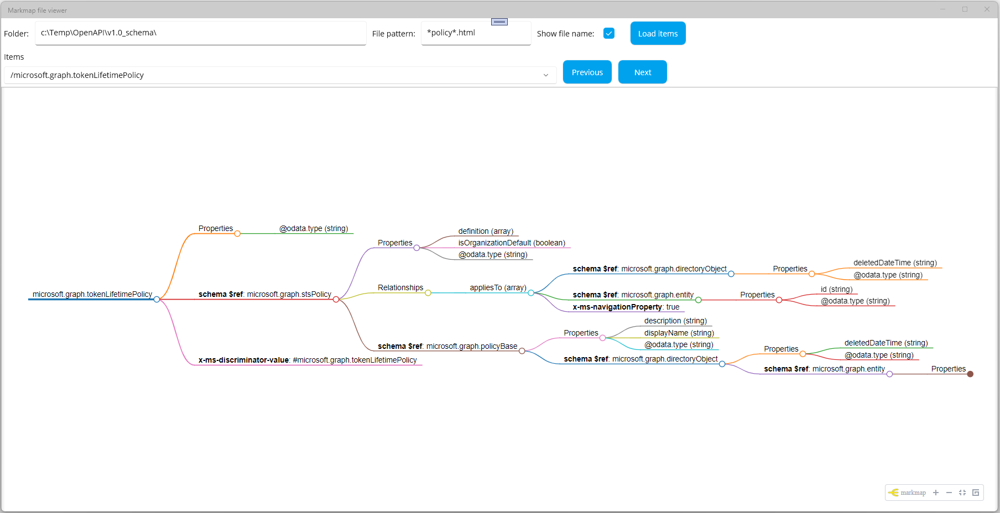

# Markmap files viewer

The **MarkmapViewer** allows you to display and browse generated markmap files.

- `Folder` - the source folder which contains markmap files
- `File pattern` - files to be searched in the source file 
    - endpoints - recommended value `endpoint.html`
    - schemas - recommended values `*.html`
- `Show file name` - if checked the name of the file is displayed
    - checked - recommended if html files are in the same folder
    - schemas - check
- `Load items` - loads files from the source folder, the markmap of the first endpoint is displayed
- `Items` - contains list of loaded files. Folder path is displayed. If `Show file name` then also the file name is displayed
- `Previous` - displays the markmap for the next item in `Items` list
- `Next` - displays the markmap for the previous item in `Items` list

## Run on local

- Clone the repo
- Open the solution file (`.sln`)
- Set `OpenApi.Tools.MarkmapViewer` as the startup project
- Run the project

## Prerequisities

.NET MAUI workloads is required.

In Visual Studio
- Open **Visual Studio Installer** by clicking on menu **Tools -> Get Tools and Features...**
- Click on the tab **Workloads**
- Select and install **.NET Multi-platform App UI development**

