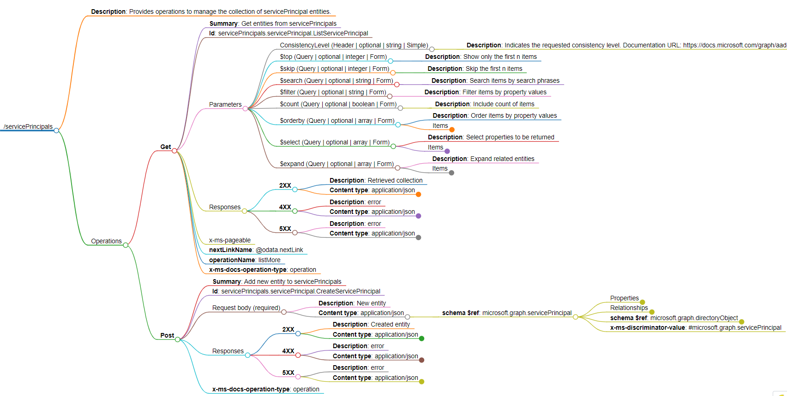
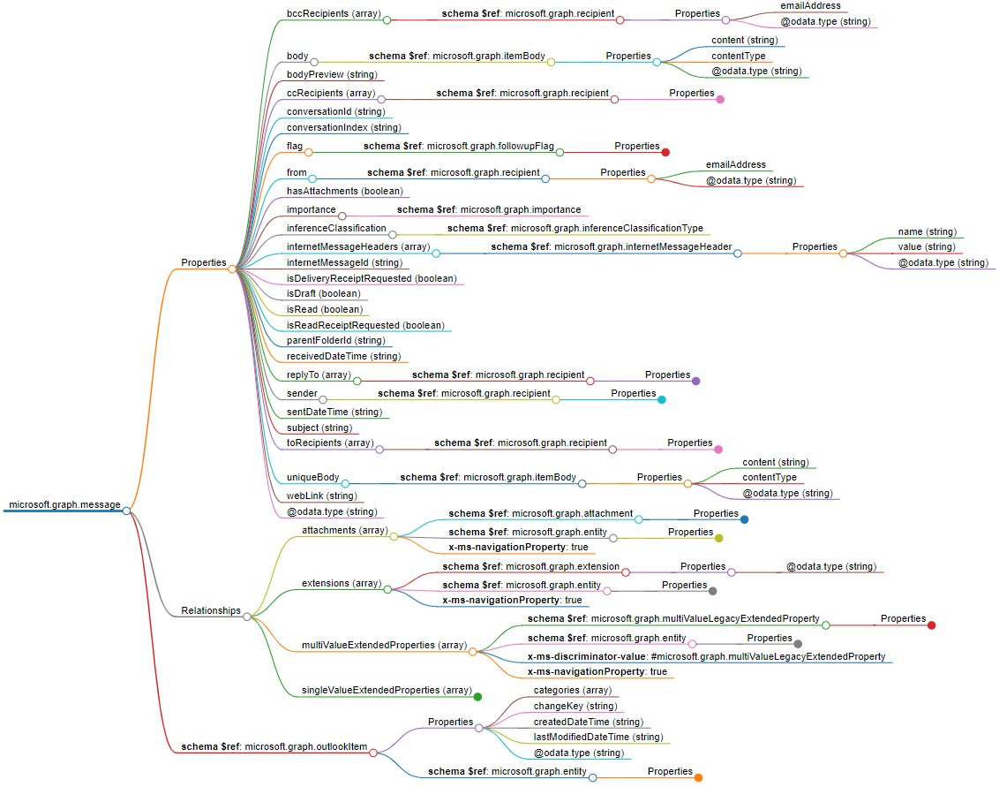

# openapi-dotnet-tools

The Open API tools allow you to read the document with Open API definition for REST API and generate markmap file for an endpoint or a schema. 

[Markmap](https://github.com/markmap/markmap) is a tool that visualizes your Markdown as mindmaps.

**Visualization of endpoint**

**Visualization of schema**

The repository contains
- command line tool for generating markmap files
- .NET library for creating markmap files
- application for displaying generated markmap files 

## OpenAPI Tools command line

The console application that generates Markdown files and markmap files.

### Installation

To install the tool via `dotnet tool`:

* Run the command `dotnet tool install --global Machy.OpenApi.Tools.Cli`

Read more: [OpenAPI Tools CLI](OpenApi.Tools.CLI/README.md)

## OpenAPI Tools library

The .NET library that generates Markdown files and markmap files.

### Installation via NuGet

To install the client library via NuGet:

* Search for `OpenApi.Tools.Core` in the NuGet Library, or
* Type `Install-Package OpenApi.Tools.Core` into the Package Manager Console.

Read more: [OpenAPI Tools library](OpenApi.Tools.Core/README.md)

## Markmap files viewer

The application which allows you to display and browse markmap files.

Read more: [Markmap files viewer](OpenApi.Tools.MarkmapViewer/README.md)

## Change appearance

Both, command line tool and .NET library allow to modify appearance of the markmap file.

Read more: [Appearance](docs/Appearance.md)

## Prerequisities

* Required: Either `.NET6` or `.NET7` must be installed on your machine
* Optional: Install npm package [markmap-cli](https://www.npmjs.com/package/markmap-cli) `npm install -g markmap-cli`

## Recommendations

Additionally for Windows OS, to handle long path for generated Markdown or markmap files

> set the value of the parameter HKLM\SYSTEM\CurrentControlSet\Control\FileSystem LongPathsEnabled to 1