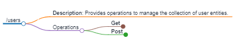

# Appearance settings

There are settings that affect the appearance of the generated markmap file.

When using the `OpenApi.Tools.Cli` tool, `gen-endpoint*` and `gen-schema*` commands have common the following options:

```
-f, --color-freeze-level <color-freeze-level>      Freeze color at the specified level of branches. 0 for no freezing
                                                   at all. [default: 6]
-n, --initial-expand-level <initial-expand-level>  The maximum level of nodes to expand on initial render. -1 for
                                                   expanding all levels. [default: 5]
-c, --color <color>                                A list of colors to use as the branch and circle colors for each
                                                   node. If none is provided, d3.schemeCategory10 will be used. []
-d, --duration <duration>                          The animation duration when folding/unfolding a node. [default:
                                                   500]
-m, --max-width <max-width>                        The max width of each node content. 0 for no limit. [default: 0]
-z, --zoom                                         Whether to allow zooming the markmap. [default: True]
-p, --pan                                          Whether to allow panning the markmap. [default: True]
-x, --max-schema-depth <max-schema-depth>          Affects how deep the writer goes in case of OpenApiSchema and its
                                                   properties. [default: 3]
-s, --max-single-items <max-single-items>          The size of OpenApiSchema Enum/Propeties collection when items are
                                                   printed one per line. [default: 10]
-g, --group-items-size <group-items-size>          Number of items from OpenApiSchema Enum/Properties that printed on
                                                   one line if the size of OpenApiSchema Enum/Properties exceeds
                                                   MaxSingleItems. [default: 6]
-h, --show-endpoint-on-root                        If true then endpoint is displayed in the root, otherwise as the
                                                   first subitem. [default: True]
```

When using the `OpenApi.Tools.Core` library, the option can be set when calling one of the following method defined by the `OpenApiTools` class.

```
Task GenerateEndpointMarkdownFileAsync(string path, string filePath, MarkdownWriterOptions markdownOptions, MarkmapOptions markmapOptions, CancellationToken cancellationToken)
Task GenerateEndpointMarkdownFilesAsync(List<string> paths, string folderPath, MarkdownWriterOptions markdownOptions, MarkmapOptions markmapOptions, CancellationToken cancellationToken)
Task GenerateSchemaMarkdownFileAsync(string name, string filePath, MarkdownWriterOptions markdownOptions, MarkmapOptions markmapOptions, CancellationToken cancellationToken)
Task GenerateSchemaMarkdownFilesAsync(List<string> schemas, string folderPath, MarkdownWriterOptions markdownOptions, MarkmapOptions markmapOptions, CancellationToken cancellationToken)
```

Markdown writer options:

```
public readonly struct MarkdownWriterOptions
{
    public readonly int MaxSchemaDepth;
    public readonly int MaxSingleItems;
    public readonly int GroupItemsSize;
    public readonly bool ShowNameInRoot;
}
```

Markmap options:

These options are identical to the official [markmap options](https://markmap.js.org/docs/json-options).

```
public readonly struct MarkmapOptions
{
    public readonly int ColorFreezeLevel;
    public readonly int InitialExpandLevel;
    public readonly string[] Color;
    public readonly int Duration;
    public readonly int MaxWidth;
    public readonly bool Zoom;
    public readonly bool Pan;
}
```

## Color freeze level

* Command option `-f, --color-freeze-level <color-freeze-level>`
* Property `MarkmapOptions.ColorFreezeLevel`

Freeze color at the specified level of branches. 0 for no freezing at all.

*Default value: 6*

Level 1:


Level 2:


## Initial expand level

* Command option `-n, --initial-expand-level <initial-expand-level>`
* Property `MarkmapOptions.InitialExpandLevel`

The maximum level of nodes to expand on initial render. -1 for expanding all levels.

*Default value: 5*

Level 0:


Level 2:



## Lines colors

* Command option `-c, --color <color>`
* Property `MarkmapOptions.Color`

A list of colors to use as the branch and circle colors for each node. If none is provided, d3.schemeCategory10 will be used.

*Default value: null (d3.schemeCategory10 is used)*

Colors [red,blue,green,yellow]:


Colors [black,grey]:


## Folding/unfolding animation duration

* Command option `-d, --duration <duration>`
* Property `MarkmapOptions.Duration`

The animation duration [ms] when folding/unfolding a node.

*Default value: 500*

## Node content max width

* Command option `-m, --max-width <max-width>`
* Property `MarkmapOptions.MaxWidth`

The max width of each node content. 0 for no limit.

*Default value: 0*

MaxWidth 0:


MaxWidth 200:


## Enable/disable zoom

* Command option `-z, --zoom`
* Property `MarkmapOptions.Zoom`

Whether to allow zooming of the markmap.

*Default value: true*

## Enable/disable pan

* Command option `-p, --pan`
* Property `MarkmapOptions.Pan`

Whether to allow panning of the markmap.

*Default value: true*

## Max depth of Open API schema

* Command option `-x, --max-schema-depth <max-schema-depth>`
* Property `MarkdownWriterOptions.MaxSchemaDepth`

Affects how deep the writer goes in case of OpenApiSchema and its properties.

*Default value: 3 for endpoints, 2 for schemas*

MaxSchemaWidth 2:


MaxSchemaWidth 4:


## Group items

* Command option `-s, --max-single-items <max-single-items>`
* Property `MarkdownWriterOptions.MaxSingleItems`

The size of OpenApiSchema.Enum or OpenApiSchema.Properties collection when items are printed one per line.

*Default value: 10 for endpoints, 0 (disabled) for schemas*

* Command option `-g, --group-items-size <group-items-size>`
* Property `MarkdownWriterOptions.GroupItemsSize`

Number of items from OpenApiSchema.Enum or OpenApiSchema.Properties that printed on one line if the size of OpenApiSchema.Enum or OpenApiSchema.Properties exceeds MaxSingleItems.

*Default value: 6 for endpoints, 0 (disabled) for schemas*

`$select` query parameter for `GET /users` allows to specify more than 100 properties. `MaxSingleItems` with default value 10 is exceeded, so properties are grouped. Each group contains max. 6 properties per line, defined by `GroupItemsSize`.


## Position of the endpoint/schema name

* Command option `-h, --show-name-in-root`
* Property `MarkdownWriterOptions.ShowNameInRoot`

If true then the name of the endpoint or the schema is displayed in the root, otherwise as the first subitem. Useful when the name of the endpoint is too long.

*Default value: true*

ShowNameInRoot false:

